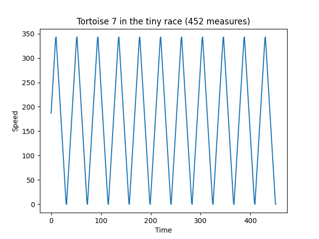
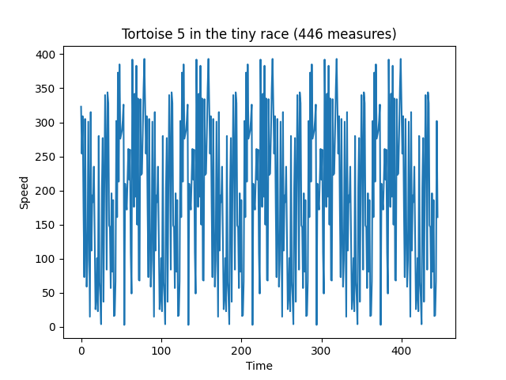
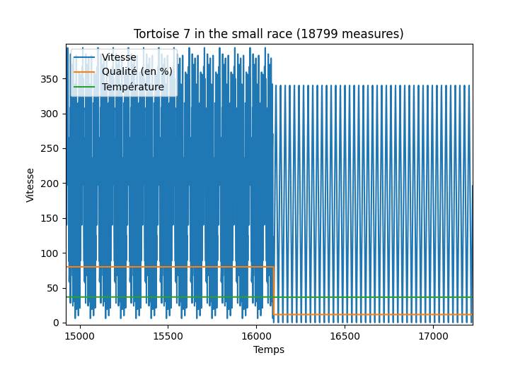

# Course Tortues


Participant au projet :


- Imane Tazi


- Naoufel Chafik


- Manale Essajidi


- Lucas Ruston

Ce programme a été testé sur le compte p2113357. 

## Introduction


Ce TP a pour but de prédire la position de tortues au sein d'une course de tortue. Des données nous sont fournies toutes les 3 secondes sur le serveur disponible à cette adresse : [ici](http://tortues.ecoquery.os.univ-lyon1.fr). Il existe plusieurs types de tortues et un modèle devra permettre de prédire leurs comportements et ainsi de prédire leurs déplacements.


Pour répondre à cette problématique notre programme a été découpé en plusieurs sous-partis :


- Un scrapper : il va s'occuper de venir récupérer régulièrement les données auprès du serveur et à chaque fois les inscrire dans un fichier en mémoire.


- Un modèle : celui-ci va permettre en utilisant les ressources téléchargées d'effectuer des prédictions. il va s'occuper de venir récupérer régulièrement les données auprès du serveur et à chaque fois les inscrire dans un fichier en mémoire.


- Un script pour la prédiction : ce script va utiliser les données du modèle afin de prédire à partir de quelque prédiction les positions futures.


## Le scrapper


Le scrapper (dont le code est détaillé dans le fichier ```DataRetrieving.py```) va effectuer des requêtes régulièrement au serveur. En effet, le serveur met à disposition via une API des nouvelles données toutes les 3 secondes.


Pour être sûr de télécharger les données de manière continuelle et ne pas avoir de trous dans les données récoltées, le script va effectuer des requêtes de manière plus régulière que 3 secondes et supprimer tout doublon.


Pour être sûr de télécharger les données de manière continuelle et ne pas avoir de trous dans les données récoltées, le script va effectuer des requêtes de manière plus régulière que 3 secondes et supprimer tout doublon. En fonction de la machine et de la réactivité de sa connection internet, des valeurs entre 1 et 2 secondes d'attente sont efficaces. Il serait même possible de ne jamais attendre et réeffectuer en permanence la requête pour garantir d'avoir toujours les données, mais cela aurait comme conséquence la surcharge du serveur source.


L'ensemble des données sont sauvegardées dans un format de donnée identique à ce qui est reçu : un fichier JSON.


## Le modèle


Le modèle a pour but de détecter le comportement de chaque tortue :


- Les tortues régulières dont l'unique paramètre à déterminer est sa vitesse constante


- Les tortues cycliques dont il faut déterminer la liste des vitesses successives pour une période et la période de cycle


- Les tortues fatiguées dont il faut déterminer la vitesse initiale (ou vitesse max) et la vitesse de décroissance


- Les tortues lunatiques dont le comportement est successivement composé des 3 précédents comportements. Il faudra déterminer les paramètres de chaque comportement et également déterminer quel est le comportement de la tortue en fonction de la qualité du repas et de la température.


Pour cela, chaque comportement va être détecté d'une manière différente. On dispose en entrée de chaque modèle une liste de coordonnées, température et qualité du repas en fonction du temps.


### Les tortues régulières


On effectue tout d'abord une dérivée discrète par rapport au temps des coordonnées de la tortue. On obtient ainsi la vitesse en fonction du temps. Si la vitesse est constante (ie. son maximum est égal à son minimum) alors celle-ci est une tortue régulière.


### Les tortues fatiguées



On vérifie tout d'abord que la tortue n'est pas une tortue régulière. Ensuite, on réalise la dérivée discrète seconde par rapport au temps afin d'obtenir l'accélération par rapport au temps.


La valeur de l'accélération doit prendre un nombre de valeurs compris entre 2 et 4 On dispose en entrée de chaque modèle une liste de coordonnées, température et qualité du repas en fonction du temps.. Les paramètres du modèle sont donc la vitesse initiale qui est la vitesse maximale, et la valeur absolue de l'accélération hors régime de transition.


### Les tortues cycliques



Par convention, on vérifie tout d'abord les 2 autres comportements avant de vérifier si une tortue est cyclique. Il aurait pu être possible de simplifier les modèles et considérer que les 2 autres cas sont également des tortues cycliques, mais cela ne sera pas fait dans ce TP en raison de l'énoncé.

Pour détecter ces tortues, on itère sur les vitesses jusqu'à se retrouver dans une boucle. 


### Les tortues lunatiques



Les tortues lunatiques sont des tortues dont le comportement change en fonction de la qualité du repas et de la température. La première étape est donc de diviser les données pour déterminer sur chaque intervalle de température et de qualité de repas constant, les paramètres de chacun de ces comportements. Pour cela, les 3 précédents modèles de comportement seront utilisés.


Ensuite, il faut déterminer quel comportement la tortue adopte en fonction de la température et la qualité du repas. Étant donné le nombre de paramètre réduit (seulement 2), plusieurs stratégies d'apprentissage supervisées sont possible :


- K Nearest neighbors : Étant donné un couple température / qualité de repas, on recherche les K plus proches voisins (c'est à dire les couples dont les valeurs sont les plus proches de celles considéré au sens d'une mesure choisi). En fonction de la classe de comportement de ces K plus proches voisins on en déduit celle de la mesure à déterminer. Cet algorithme impose de déterminer une mesure et d'ajuster l'hyperparamètre K.


- Régression logistique : C'est un modèle de régression binomiale qui va découper l'espace selon des hyper-plans (qui seront ici des droites) et va ainsi permettre de déterminer des zones pour chaque modèle de comportement.

Dans notre cas, nous utiliseront un KNN avec pour hyper-paramètre K=1. En effet, le manque de données à nos dispositions (notre scapper a été fonctionnel tardivement combiné à des soucis de trou dans les mesures) nous oblige à utiliser une valeur de K relativement faible.

Le modèle développé ici est fonctionnel et a été testé avec succès sur la tortue cyclique numéro 7 de la course "small". Nénamoins en raison d'un manque de temps, le modèle complet n'a pas été réentrainé sur l'intégralité des données et les tortues lunatiques ne sont donc pas détecté par l'algorithme car il considère une trop faible pèriode temporelle.

### Le fichier model.json
Le fichier model.json regroupe les comportements de chaque tortue ainsi que les paramètres permettant de recalculer leur positions.


Voici un exemple de celui-ci : 
```json
...
        {
            "Tortoise": 1,
            "class": 2,
            "params": {
                "window": [51, 122, 138, 130, 350, 302, 278, 84, 248, 294, 173, 25, 336, 9, 129, 297, 40, 386, 5, 309, 257, 178, 310, 301, 52, 199, 4, 191, 67, 222, 179, 106, 287, 329, 22, 180, 389, 29, 69, 277, 128, 270, 249, 162, 15, 319, 92, 381, 349, 200, 252, 275, 90, 303, 299, 74, 195, 227, 355, 274, 320 ]}
        },
        {
            "Tortoise": 2,
            "class": 1,
            "params": {
                "initial": 31,
                "rhythm": 10,
                "extra_params": {
                    "qualite": 0.863381793014835,
                    "temperature": 20.980595977843635
                }
            }
        },
...
```

De plus à titre d'exemple, voilà le résultat sur un entrainement sur une tortue lunatique : 

```json
{ "Tortoise": 2,
  "comportment": {3: {
    "window": [155, 127, 105, 131, 236, 46, 58, 95, 315, 10, 122, 109, 269, 359, 36, 35, 129, 210, 21, 356, 93, 125, 89,
               322, 321, 355, 158, 337, 140, 141, 367, 197, 324, 280, 394, 207, 350, 304, 206, 264, 132, 88, 265, 59,
               69, 77, 166, 57, 308, 302, 28, 385, 245, 67, 261, 84, 195, 81, 83, 370, 235, 137, 358, 76, 24, 218, 202,
               379, 284, 52, 116, 285, 30, 342, 119, 249, 271, 6, 39, 96, 123, 48, 283, 383, 178, 19]},
                 2: {"initial": 340, "rhythm": 28}},
 "intervals": [{"class": 3, "temperature": 34.946879334390516, "quality": 0.7990277777925706},
               {"class": 3, "temperature": 36.47599833046669, "quality": 0.7990277777925706},
               {"class": 3, "temperature": 38.19524228402687, "quality": 0.7990277777925706},
               {"class": 3, "temperature": 39.333480263868815, "quality": 0.7990277777925706},
               {"class": 3, "temperature": 40.0, "quality": 0.7990277777925706},
               {"class": 3, "temperature": 38.83047751068756, "quality": 0.7990277777925706},
               {"class": 3, "temperature": 37.46443577542516, "quality": 0.7990277777925706},
               {"class": 3, "temperature": 36.68533377957218, "quality": 0.7990277777925706},
               {"class": 3, "temperature": 36.454067353799296, "quality": 0.11494012255509778},
               {"class": 2, "temperature": 35.93714055374335, "quality": 0.11494012255509778},
               {"class": 2, "temperature": 33.969667509232714, "quality": 0.11494012255509778}]}
```


## Le script de prédiction

Le script de prédiction se base sur le fichier model.json et recalcule à partir des différents paramètres la position de chaque tortue. 

Dans le cas des tortues lunatiques, il récupère l'ensemble des classes associés à un couple température / qualité. 
Il calcul ensuite un vecteur de distance (basé sur la norme 2). C'est la norme qui semble évidente pour ce projet
mais qui pourrait sûrement être ajusté par la suite en fonction des résultats sur le set de donnée complet. Une fois le vecteur de distance trouvé,
on calcul ces K maximaux et on en déduit la classe associé au couple de température / qualité souhaité. 


